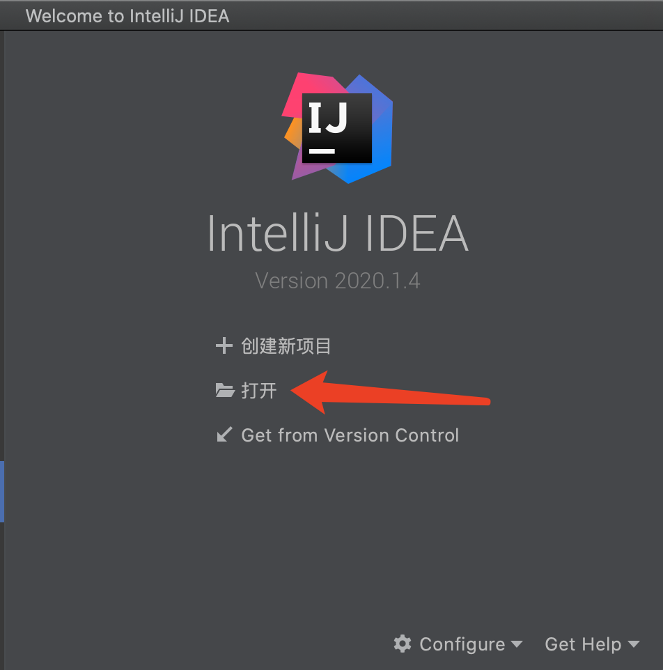
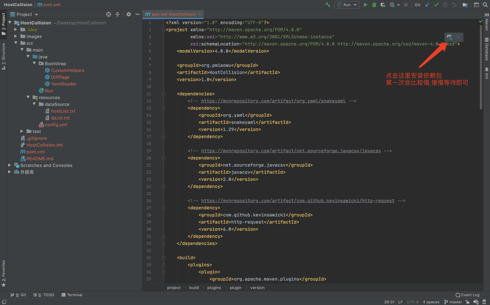
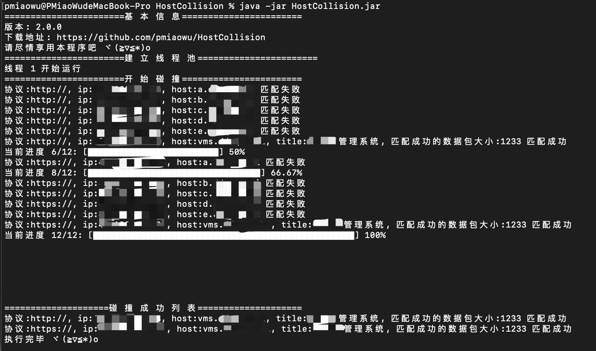
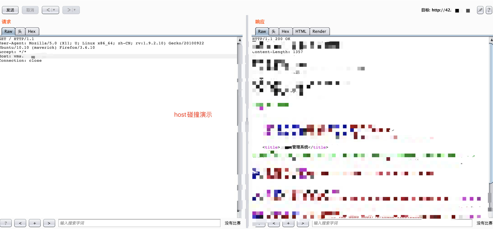

# 0x01 HostCollision
用于host碰撞而生的小工具,专门检测渗透中需要绑定hosts才能访问的主机或内部系统

# 0x02 自言自语
写这个工具最主要是因为作者自己的使用问题还有解决一些特殊情况下的误报问题,于是它就诞生了 :)

支持动态多线程,设置代理,设置扫描协议 等等操作

# 0x03 编译方法

<details>
<summary><b>编译方法</b></summary>

这是一个 java maven项目

java版本为 1.8

导入idea,打开刚刚好下载好的源码



打开: /HostCollision/pom.xml 安装对应的包,第一次安装依赖包需要比较久,慢慢等不要急




编译文件地址: /HostCollision/target/HostCollision/

jar包地址: /HostCollision/target/HostCollision/HostCollision.jar

项目配置文件地址: /HostCollision/target/HostCollision/config.yml

接着拿着这个 HostCollision.jar 进行使用即可

</details>

# 0x04 使用方法

```
# 目录结构
├── HostCollision
│   ├── HostCollision.jar (主程序)
│   ├── config.yml (配置文件,保存着程序各种设置)
│   └── dataSource (程序进行host碰撞的数据来源)
│     ├── ipList.txt (输入ip地址,一行一个目标)
│     └── hostList.txt (输入host地址,一行一个目标)
```

## 0x04.1 帮助文档

```
命令: java -jar HostCollision.jar -h
```

```
返回:

HostCollision % java -jar HostCollision.jar -h
=======================基 本 信 息=======================
版本: 2.1.0
下载地址: https://github.com/pmiaowu/HostCollision
请尽情享用本程序吧 ヾ(≧▽≦*)o
=======================使 用 文 档=======================
-h/-help                            使用文档
-sp/-scanProtocol                   允许的扫描协议<例如:http,https>
-ifp/-ipFilePath                    ip数据来源地址<例如:./dataSource/ipList.txt>
-hfp/-hostFilePath                  host数据来源地址<例如:./dataSource/hostList.txt>
-t/-threadTotal                     程序运行的最大线程总数<例如:6>
-o/-output                          导出格式,使用逗号分割<例如:csv,txt>
-ioel/-isOutputErrorLog             是否将错误日志输出<例如:true/false>
-cssc/-collisionSuccessStatusCode   认为碰撞成功的状态码,使用逗号分割<例如: 200,301,302>
```

## 0x04.2 基础使用方法

```
啥也不加会默认读取 config.yml 配置,运行程序

读取 dataSource 目录 ipList.txt 和 hostList.txt 的数据,进行遍历匹配访问

命令: java -jar HostCollision.jar

执行完毕以后会在根目录生成一个 年-月-日_8位随机数 的 csv/txt 文件
里面会保存碰撞成功的结果

没事可以看看 config.yml 文件, 里面保存了程序的各种配置, 可以自由搭配
```

扫描结果





## 0x04.3 命令行带参数

```
设置为:
    扫描协议为: http
    最大线程为: 1
    导出格式: csv 与 txt 全都要
    ip目录: 当前目录的ips.txt
    host目录: 当前目录的hosts.txt

命令: java -jar HostCollision.jar -sp "http" -t 1 -o "csv,txt" -ifp "./ips.txt" -hfp "./hosts.txt"
```